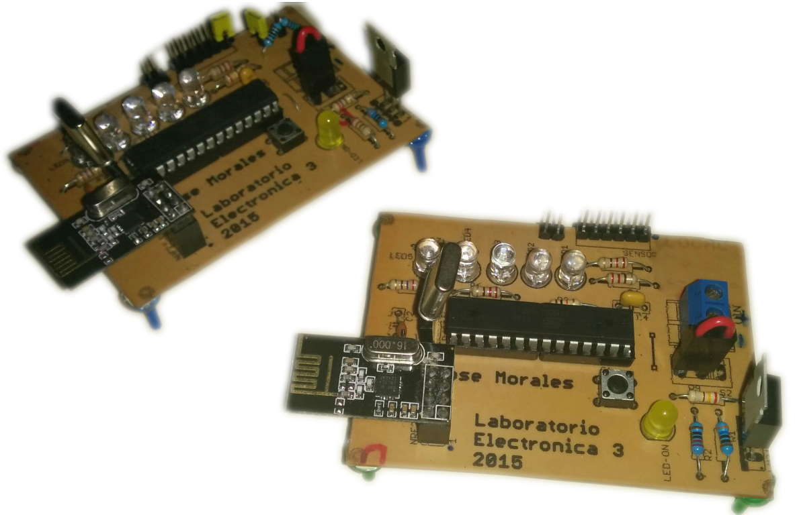

# Wireless Water Level Meter

## Description

System for measuring the water level in a tank using a current loop (4 mA to 20 mA) wirelessly.

The system consists of 2 modules, a local module and a remote module.
	The local module reads the level of water and transmits it to the remote module (using nRF24L0).
	The remote receives the data and displays it using 5 LEDs, corresponding to the 5 levels of water, from empty to full.

## Features
- Wireless, using nRF24L0.
- Programmed via Arduino using an Atmega328P.
- LEDs indicating the level of water in both modules (local and remote).
- Powered with 5V via screw terminals.
- Programming headers (serial) to facilitate the reprogramming of the microcontrollers.
	- Programs using an Arduino.
